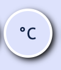
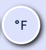
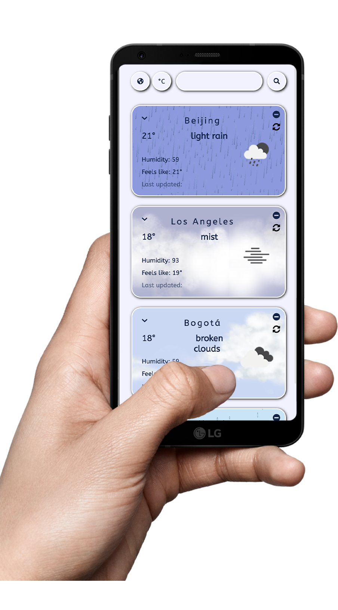

# TemperaSure
TemperaSure is a weather app that shows the current weather all around the world.
(Designed for mobile)

# Features
## Current location
- Showing the weather in the user's current location, as captured by the browser according to the geographic position of the used device.
- The current location is shown directly as the use enters the app and allows access to their device's location.
- The current location is displayed in the current-location tab, and can be accessed through the location toggle button
- 

## Searching other locations
- The user can search for another location all around the world, by using the search bar.
- Each searched location can be *pinned* - saving it to the DB with its current details, or *refreshed* - getting the updated weather for this location and saving it to the DB.
- The searched-locations is displayed in the searched-locations tab, and can be accessed through the location toggle button
- 

## Switching temperature units
- The user can toggle between Celsius and Farenheit
- 
- 
- Temperature unit preferences are saved to the browser's local storage

# Demo
https://temperasure.herokuapp.com/
- 

# External Resources
- https://openweathermap.org